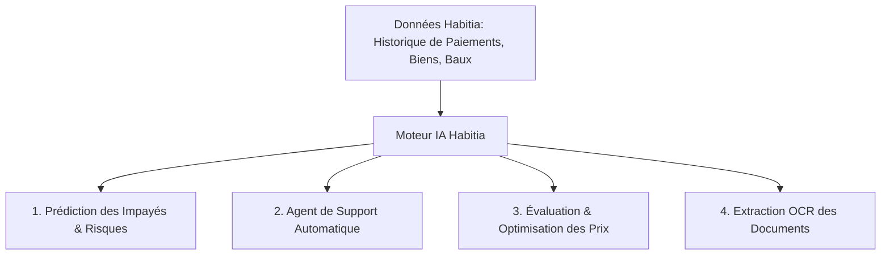

# Habitia - Documentation Technique & Synthèse Globale

Habitia est une application SaaS de gestion immobilière premium conçue pour le marché ouest-africain. Cette documentation présente l'architecture, les fonctionnalités implémentées, la structure des fichiers, les choix technologiques, les décisions de conception et la feuille de route pour l'intégration de modèles d'intelligence artificielle.

---

## 1. Fonctionnalités de l'Application

Habitia offre une suite complète d'outils pour les agences immobilières, les gestionnaires de biens, les bailleurs et les comptables :

### Gestion des Propriétaires (Bailleurs)
- **Fiches Détaillées** : Suivi des informations de contact, documents officiels (mandats de gérance, CIN/Passeport).
- **Bilan Financier & Retrait de Loyer** : Édition dynamique de relevés de gérance (modèle de facture Hamet Séméga), déduction automatique des frais de gérance (configurable en %), calcul du net à reverser et exportation au format PDF pour impression.

### Gestion des Biens Immobiliers
- **Fiches Techniques** : Type (villa, appartement, bureau, terrain), surface, propriétaire mandant, charges associées (syndic, gardiennage).
- **Géolocalisation** : Visualisation cartographique interactive des biens via Leaflet.js.

### Gestion des Locataires (Interactive)
- **Ajout Intuitif** : Boîte modale permettant de renseigner le locataire, son employeur, son garant, son loyer de base, sa caution et son mois de début de bail.
- **Attribution des Biens** : Filtrage et blocage des logements déjà occupés pour éviter la sur-allocation.
- **Fiche de Paiement Dynamique (Bilan Locataire)** :
  - Grille automatisée sur 13 mois glissants à partir du mois de début de bail.
  - Saisie en temps réel du loyer de base et des montants réglés ("Payé ce mois").
  - Calcul cumulé automatique du **Solde** et du **Reliquat**.
  - Détection automatique du nombre de mois d'**Avance** ou de **Retard**.
  - Attribution automatique des statuts : **En avance** (Bleu), **À jour** (Vert), et **Pas à jour** (Rouge).
  - Persistance locale via `localStorage` pour conserver les données de paiement lors du rafraîchissement.

### Comptabilité & Transactions
- Enregistrement des règlements (encaissements de loyer, cautions) et des dépenses (maintenance, travaux).
- Simulation de génération de quittances PDF.
- Exportation complète du livre journal au format CSV.

---

## 2. Structure du Monorepo

Le projet est organisé sous forme de monorepo pour séparer proprement le frontend, l'API et les structures de données partagées :

```
/
├── apps/
│   ├── web/             # Frontend React 18 (Vite, TypeScript, TailwindCSS)
│   │   ├── src/
│   │   │   ├── components/ # Composants d'interface (UI, Cartes, Tableaux)
│   │   │   ├── pages/      # Pages de l'application (Bailleurs, Locataires, Comptabilité, Personnels)
│   │   │   └── App.tsx     # Point d'entrée principal React
│   │   └── index.html      # Document HTML d'entrée frontend
│   │
│   └── api/             # Backend Node.js & Express
│       ├── src/
│       │   ├── controllers/ # Contrôleurs (Auth, Biens, Paiements, Retraits)
│       │   ├── middlewares/ # Protection par rôles, validation JWT
│       │   └── index.ts     # Serveur Express principal
│       └── prisma/          # Schéma de base de données ORM Prisma (Supabase PostgreSQL)
│
├── packages/
│   └── types/           # Interfaces TypeScript partagées (User, Locataire, Bien, Transaction)
│
├── preview.html         # Mockup fonctionnel complet et autonome (pour tests rapides et validations)
└── README.md            # Notice d'installation générale du projet
```

---

## 3. Stack Technologique

| Couche | Technologie | Rôle / Utilisation |
| :--- | :--- | :--- |
| **Frontend** | React 18 & TypeScript | Construction de l'interface utilisateur réactive |
| **Design** | TailwindCSS | Design système, thèmes responsive et esthétique premium |
| **State** | Zustand & React Query | Gestion globale des états et mise en cache des requêtes API |
| **Formulaires** | React Hook Form & Zod | Validation stricte des données de formulaires |
| **Cartes** | Leaflet.js | Cartographie et géolocalisation des biens gérés |
| **Stockage local** | LocalStorage | Sauvegarde de l'état du mockup autonome |
| **Backend** | Node.js & Express | API REST, traitement des requêtes et logique métier |
| **Base de Données**| Supabase (PostgreSQL) | Hébergement cloud de la base de données relationnelle |
| **ORM** | Prisma | Modélisation des données et requêtage typé |
| **Génération PDF**| PDFKit | Création des quittances et des bilans de retrait |

---

## 4. Décisions de Design & Expérience Utilisateur (UX)

1. **Esthétique Sombre/Clair Dynamique** : Bascule de thème instantanée, respectant les préférences utilisateur avec des contrastes soignés.
2. **Design Système Couleur** :
   - Couleur Primaire : Indigo élégant pour la navigation et les boutons principaux.
   - Vert Émeraude (`bg-success-600`) : Statut **À jour** et encaissements positifs.
   - Rose/Rouge (`bg-danger-600`) : Statut **Pas à jour** (dette, retards) et décaissements.
   - Bleu Azur (`bg-blue-600`) : Statut **En avance** pour mettre en valeur les locataires créditeurs.
3. **Simplicité d'Édition** : Les grilles financières complexes (grille bailleur et grille locataire) permettent la modification directe des données numériques avec recalcul instantané pour réduire le nombre de clics.

---

## 5. Intégration Future de Modèles d'Intelligence Artificielle (IA)

Habitia est structurée pour accueillir des fonctionnalités intelligentes reposant sur des modèles de Machine Learning et d'IA générative :



### 1. Prédiction du Risque d'Impayés (Modèles de Classification)
- **Objectif** : Anticiper les retards de loyers et affecter un score de confiance aux candidats.
- **Données d'Entrée (Features)** : Ratio Caution/Loyer, historique de ponctualité de paiement, stabilité de l'employeur, évolution du reliquat cumulé sur les 6 derniers mois.
- **Structure IA** : Modèle de forêt aléatoire (Random Forest) ou de régression logistique entraîné sur l'historique anonymisé des baux.

### 2. Copilote Client & Rappels Automatiques (Modèles LLM)
- **Objectif** : Rédiger automatiquement des courriels et SMS personnalisés de relance ou de quittance.
- **Structure IA** : Intégration de modèles de langage (ex: Gemini Flash via API) pour formuler des messages adaptés au profil du locataire (courtois pour un premier oubli, formel pour des retards récurrents) à partir de son tableau de bord financier.

### 3. Analyse Prédictive des Loyers (Régression)
- **Objectif** : Suggérer aux propriétaires le prix de loyer optimal pour maximiser le taux d'occupation.
- **Données d'Entrée** : Type de bien, surface, quartier (ville), charges, proximité des infrastructures, et prix des biens similaires dans le secteur.
- **Structure IA** : Algorithme de régression linéaire ou XGBoost prédisant la valeur locative estimée.

### 4. OCR & Analyse de Documents (Vision par Ordinateur)
- **Objectif** : Extraire automatiquement les données des mandats de gérance scannés (PDF) ou des passeports des locataires.
- **Structure IA** : Utilisation d'un modèle d'extraction d'entités nommées par vision (document AI) pour pré-remplir les formulaires de création de bailleurs et de locataires en un clic.
